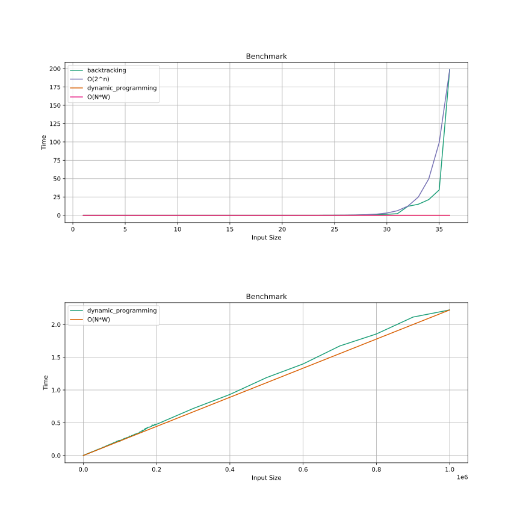

# Trabalho Final de Análise de Algoritmos (DCC606 - 2024)

## Integrantes

- Eduardo Henrique Freire Machado (2020001617);
- Fernando Souza Rodrigues (2019037493).

## Introdução

Este trabalho faz a análise de um algoritmo que utiliza de Programação Dinâmica para resolver o Problema da Mochila (*Knapsack Problem*). A análise engloba:

- Função de custo e complexidade do algoritmo;
- Código em C do algoritmo proposto;
- *Benchmark* do algoritmo com diferentes entradas;
- Gráfico mostrando a relação entrada-tempo e sua tendência de comportamento assintótico;

Ela pode ainda mostrar a comparação entre os resultados do algoritmo proposto e de outras soluções, por exemplo:

- Resolução por algoritmo guloso (*greedy*);
- Resolução por força bruta (*backtracking*);
- Resolução por ramificação e poda (*branch and bound*).

## Cálculos de Custo e Complexidade

### Programação Dinâmica

<!-- TODO -->

### Algoritmo Genético

<!-- TODO -->

### Algoritmo Guloso

<!-- TODO -->

### Força Bruta

<!-- TODO -->

### Ramificação e Poda

<!-- TODO -->

## Resultados

### Literatura

<!-- TODO -->

### Equipe

## Demonstração Visual

<!-- TODO -->

## Objetivos

- [ ] Função de custo e complexidade;
- [x] Código em C do algoritmo proposto;
- [x] Experimentação com a execução do algoritmo com diferentes entradas e coleta de tempo de execução;
- [ ] Gráfico de linha com o tempo de execução em relação a cada entrada e análise da tendência de comportamento assintótico.

### Extras

- [x] Comparação com outras soluções;
- [ ] Funções de custo e complexidade das outras soluções.

## Considerações

- Binários em C foram compilados usando o `gcc`, com as flags `Wall`, `Wextra` e `-O3`;
- O algoritmo `backtracking` não pôde ser analisado pois ele não suportou as entradas, que iniciavam em 1000 itens.

## Referências
